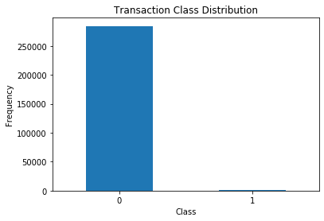
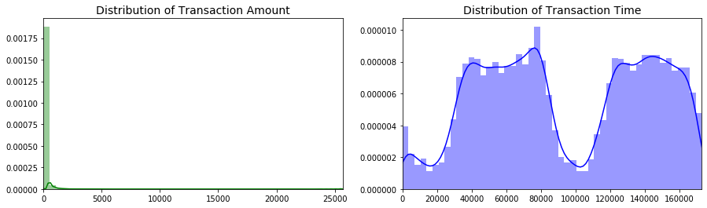
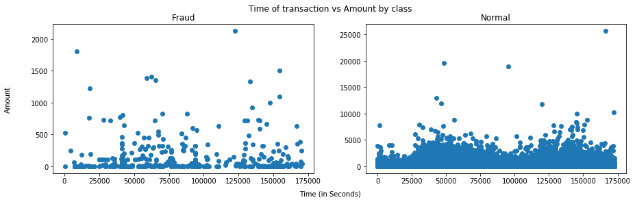
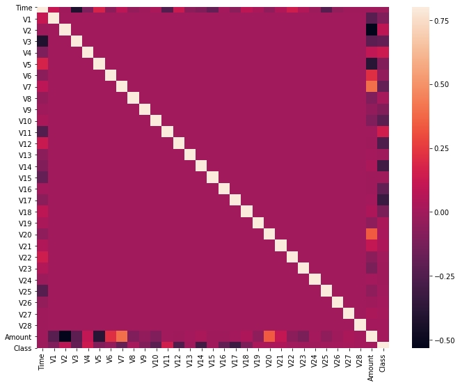
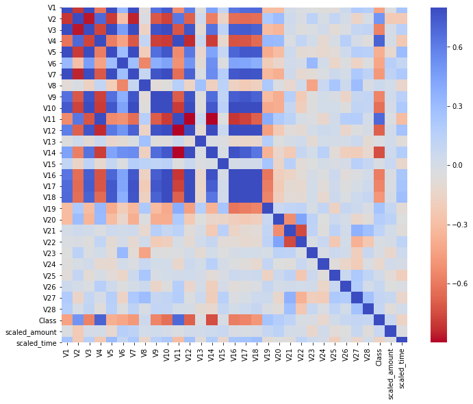
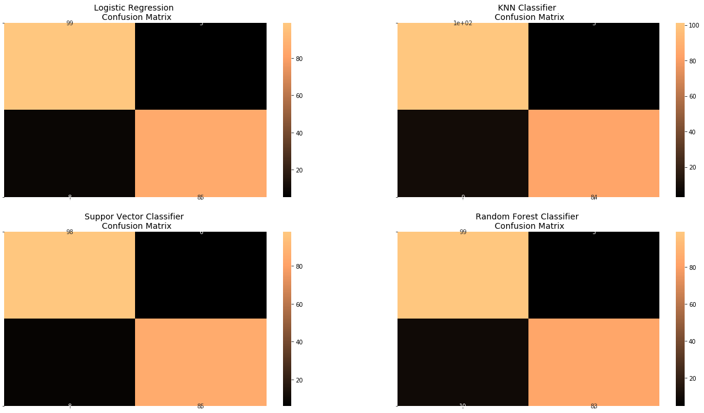

# Credit Card Fraud Detection


#### Dataset: https://www.kaggle.com/mlg-ulb/creditcardfraud

## Classification using Machine Learning methods
For this project, I will be using Logistic Regression, K-Nearest Neighbors, Support Vector Machine, Decision Tree, and Random Forest to detect credit card fraud.

## Result

Logistic Regression has **93% accuracy score**

K-Nearest Neighbors has **94% accuracy score**

Support Vector has **93% accuracy score**

Decision Tree has **93% accuracy score**

Random Forest has **92% accuracy score**

# Explore the Data

```python
df.describe()
```

<table border="1" class="dataframe">
  <thead>
    <tr style="text-align: right;">
      <th></th>
      <th>Time</th>
      <th>V1</th>
      <th>V2</th>
      <th>V3</th>
      <th>V4</th>
      <th>V5</th>
      <th>V6</th>
      <th>V7</th>
      <th>V8</th>
      <th>V9</th>
      <th>...</th>
      <th>V21</th>
      <th>V22</th>
      <th>V23</th>
      <th>V24</th>
      <th>V25</th>
      <th>V26</th>
      <th>V27</th>
      <th>V28</th>
      <th>Amount</th>
      <th>Class</th>
    </tr>
  </thead>
  <tbody>
    <tr>
      <td>count</td>
      <td>284807.000000</td>
      <td>2.848070e+05</td>
      <td>2.848070e+05</td>
      <td>2.848070e+05</td>
      <td>2.848070e+05</td>
      <td>2.848070e+05</td>
      <td>2.848070e+05</td>
      <td>2.848070e+05</td>
      <td>2.848070e+05</td>
      <td>2.848070e+05</td>
      <td>...</td>
      <td>2.848070e+05</td>
      <td>2.848070e+05</td>
      <td>2.848070e+05</td>
      <td>2.848070e+05</td>
      <td>2.848070e+05</td>
      <td>2.848070e+05</td>
      <td>2.848070e+05</td>
      <td>2.848070e+05</td>
      <td>284807.000000</td>
      <td>284807.000000</td>
    </tr>
    <tr>
      <td>mean</td>
      <td>94813.859575</td>
      <td>3.919560e-15</td>
      <td>5.688174e-16</td>
      <td>-8.769071e-15</td>
      <td>2.782312e-15</td>
      <td>-1.552563e-15</td>
      <td>2.010663e-15</td>
      <td>-1.694249e-15</td>
      <td>-1.927028e-16</td>
      <td>-3.137024e-15</td>
      <td>...</td>
      <td>1.537294e-16</td>
      <td>7.959909e-16</td>
      <td>5.367590e-16</td>
      <td>4.458112e-15</td>
      <td>1.453003e-15</td>
      <td>1.699104e-15</td>
      <td>-3.660161e-16</td>
      <td>-1.206049e-16</td>
      <td>88.349619</td>
      <td>0.001727</td>
    </tr>
    <tr>
      <td>std</td>
      <td>47488.145955</td>
      <td>1.958696e+00</td>
      <td>1.651309e+00</td>
      <td>1.516255e+00</td>
      <td>1.415869e+00</td>
      <td>1.380247e+00</td>
      <td>1.332271e+00</td>
      <td>1.237094e+00</td>
      <td>1.194353e+00</td>
      <td>1.098632e+00</td>
      <td>...</td>
      <td>7.345240e-01</td>
      <td>7.257016e-01</td>
      <td>6.244603e-01</td>
      <td>6.056471e-01</td>
      <td>5.212781e-01</td>
      <td>4.822270e-01</td>
      <td>4.036325e-01</td>
      <td>3.300833e-01</td>
      <td>250.120109</td>
      <td>0.041527</td>
    </tr>
    <tr>
      <td>min</td>
      <td>0.000000</td>
      <td>-5.640751e+01</td>
      <td>-7.271573e+01</td>
      <td>-4.832559e+01</td>
      <td>-5.683171e+00</td>
      <td>-1.137433e+02</td>
      <td>-2.616051e+01</td>
      <td>-4.355724e+01</td>
      <td>-7.321672e+01</td>
      <td>-1.343407e+01</td>
      <td>...</td>
      <td>-3.483038e+01</td>
      <td>-1.093314e+01</td>
      <td>-4.480774e+01</td>
      <td>-2.836627e+00</td>
      <td>-1.029540e+01</td>
      <td>-2.604551e+00</td>
      <td>-2.256568e+01</td>
      <td>-1.543008e+01</td>
      <td>0.000000</td>
      <td>0.000000</td>
    </tr>
    <tr>
      <td>25%</td>
      <td>54201.500000</td>
      <td>-9.203734e-01</td>
      <td>-5.985499e-01</td>
      <td>-8.903648e-01</td>
      <td>-8.486401e-01</td>
      <td>-6.915971e-01</td>
      <td>-7.682956e-01</td>
      <td>-5.540759e-01</td>
      <td>-2.086297e-01</td>
      <td>-6.430976e-01</td>
      <td>...</td>
      <td>-2.283949e-01</td>
      <td>-5.423504e-01</td>
      <td>-1.618463e-01</td>
      <td>-3.545861e-01</td>
      <td>-3.171451e-01</td>
      <td>-3.269839e-01</td>
      <td>-7.083953e-02</td>
      <td>-5.295979e-02</td>
      <td>5.600000</td>
      <td>0.000000</td>
    </tr>
    <tr>
      <td>50%</td>
      <td>84692.000000</td>
      <td>1.810880e-02</td>
      <td>6.548556e-02</td>
      <td>1.798463e-01</td>
      <td>-1.984653e-02</td>
      <td>-5.433583e-02</td>
      <td>-2.741871e-01</td>
      <td>4.010308e-02</td>
      <td>2.235804e-02</td>
      <td>-5.142873e-02</td>
      <td>...</td>
      <td>-2.945017e-02</td>
      <td>6.781943e-03</td>
      <td>-1.119293e-02</td>
      <td>4.097606e-02</td>
      <td>1.659350e-02</td>
      <td>-5.213911e-02</td>
      <td>1.342146e-03</td>
      <td>1.124383e-02</td>
      <td>22.000000</td>
      <td>0.000000</td>
    </tr>
    <tr>
      <td>75%</td>
      <td>139320.500000</td>
      <td>1.315642e+00</td>
      <td>8.037239e-01</td>
      <td>1.027196e+00</td>
      <td>7.433413e-01</td>
      <td>6.119264e-01</td>
      <td>3.985649e-01</td>
      <td>5.704361e-01</td>
      <td>3.273459e-01</td>
      <td>5.971390e-01</td>
      <td>...</td>
      <td>1.863772e-01</td>
      <td>5.285536e-01</td>
      <td>1.476421e-01</td>
      <td>4.395266e-01</td>
      <td>3.507156e-01</td>
      <td>2.409522e-01</td>
      <td>9.104512e-02</td>
      <td>7.827995e-02</td>
      <td>77.165000</td>
      <td>0.000000</td>
    </tr>
    <tr>
      <td>max</td>
      <td>172792.000000</td>
      <td>2.454930e+00</td>
      <td>2.205773e+01</td>
      <td>9.382558e+00</td>
      <td>1.687534e+01</td>
      <td>3.480167e+01</td>
      <td>7.330163e+01</td>
      <td>1.205895e+02</td>
      <td>2.000721e+01</td>
      <td>1.559499e+01</td>
      <td>...</td>
      <td>2.720284e+01</td>
      <td>1.050309e+01</td>
      <td>2.252841e+01</td>
      <td>4.584549e+00</td>
      <td>7.519589e+00</td>
      <td>3.517346e+00</td>
      <td>3.161220e+01</td>
      <td>3.384781e+01</td>
      <td>25691.160000</td>
      <td>1.000000</td>
    </tr>
  </tbody>
</table>
<p>8 rows × 31 columns</p>
</div>


```python
class_count = pd.value_counts(df['Class'],sort = True).sort_index()
class_count.plot(kind = 'bar', rot=0)
plt.title("Transaction Class Distribution")
plt.xlabel("Class")
plt.ylabel("Frequency");
```





```python
print('Normal:', round(df['Class'].value_counts()[0],2), 
      'cases, which is', round(df['Class'].value_counts()[0]/len(df) * 100,2), '% of the dataset')
print('Fraud:', round(df['Class'].value_counts()[1],2), 
      'cases, which is',round(df['Class'].value_counts()[1]/len(df) * 100,2), '% of the dataset')
```

Normal: 284315 cases, which is 99.83 % of the dataset

Fraud: 492 cases, which is 0.17 % of the dataset

```python
Fraud = df[df['Class']==1]
Normal = df[df['Class']==0]

fig, ax = plt.subplots(1,2,figsize=(15,4))

amount_val = df['Amount'].values
time_val = df['Time'].values

sns.distplot(amount_val, ax=ax[0], color = 'g')
ax[0].set_title('Distribution of Transaction Amount', fontsize = 14)
ax[0].set_xlim([min(amount_val), max(amount_val)])

sns.distplot(time_val, ax=ax[1], color = 'b')
ax[1].set_title('Distribution of Transaction Time', fontsize = 14)
ax[1].set_xlim([min(time_val), max(time_val)])

plt.show()
```





```python
f, (ax1, ax2) = plt.subplots(1, 2, figsize=(15,4))
f.suptitle('Time of transaction vs Amount by class')
ax1.scatter(Fraud.Time, Fraud.Amount)
ax1.set_title('Fraud')
ax2.scatter(Normal.Time, Normal.Amount)
ax2.set_title('Normal')


f.text(0.5, 0.01, 'Time (in Seconds)', ha='center')
f.text(0.06, 0.5, 'Amount', va='center', rotation='vertical')
```


    Text(0.06, 0.5, 'Amount')





```python
correlation_matrix = df.corr()
fig = plt.figure(figsize=(12,9))
sns.heatmap(correlation_matrix,vmax=0.8,square = True)
```


    <matplotlib.axes._subplots.AxesSubplot at 0x1e1c6b51408>





# Prepare the Data

### Feature scaling 


```python
# Time and Amount have not been scaled 
from sklearn.preprocessing import StandardScaler

df['scaled_amount'] = StandardScaler().fit_transform(df['Amount'].values.reshape(-1,1))
df['scaled_time'] = StandardScaler().fit_transform(df['Time'].values.reshape(-1,1))

df.drop(['Time','Amount'], axis=1, inplace=True)
df.head()
```

<table border="1" class="dataframe">
  <thead>
    <tr style="text-align: right;">
      <th></th>
      <th>V1</th>
      <th>V2</th>
      <th>V3</th>
      <th>V4</th>
      <th>V5</th>
      <th>V6</th>
      <th>V7</th>
      <th>V8</th>
      <th>V9</th>
      <th>V10</th>
      <th>...</th>
      <th>V22</th>
      <th>V23</th>
      <th>V24</th>
      <th>V25</th>
      <th>V26</th>
      <th>V27</th>
      <th>V28</th>
      <th>Class</th>
      <th>scaled_amount</th>
      <th>scaled_time</th>
    </tr>
  </thead>
  <tbody>
    <tr>
      <td>0</td>
      <td>-1.359807</td>
      <td>-0.072781</td>
      <td>2.536347</td>
      <td>1.378155</td>
      <td>-0.338321</td>
      <td>0.462388</td>
      <td>0.239599</td>
      <td>0.098698</td>
      <td>0.363787</td>
      <td>0.090794</td>
      <td>...</td>
      <td>0.277838</td>
      <td>-0.110474</td>
      <td>0.066928</td>
      <td>0.128539</td>
      <td>-0.189115</td>
      <td>0.133558</td>
      <td>-0.021053</td>
      <td>0</td>
      <td>0.244964</td>
      <td>-1.996583</td>
    </tr>
    <tr>
      <td>1</td>
      <td>1.191857</td>
      <td>0.266151</td>
      <td>0.166480</td>
      <td>0.448154</td>
      <td>0.060018</td>
      <td>-0.082361</td>
      <td>-0.078803</td>
      <td>0.085102</td>
      <td>-0.255425</td>
      <td>-0.166974</td>
      <td>...</td>
      <td>-0.638672</td>
      <td>0.101288</td>
      <td>-0.339846</td>
      <td>0.167170</td>
      <td>0.125895</td>
      <td>-0.008983</td>
      <td>0.014724</td>
      <td>0</td>
      <td>-0.342475</td>
      <td>-1.996583</td>
    </tr>
    <tr>
      <td>2</td>
      <td>-1.358354</td>
      <td>-1.340163</td>
      <td>1.773209</td>
      <td>0.379780</td>
      <td>-0.503198</td>
      <td>1.800499</td>
      <td>0.791461</td>
      <td>0.247676</td>
      <td>-1.514654</td>
      <td>0.207643</td>
      <td>...</td>
      <td>0.771679</td>
      <td>0.909412</td>
      <td>-0.689281</td>
      <td>-0.327642</td>
      <td>-0.139097</td>
      <td>-0.055353</td>
      <td>-0.059752</td>
      <td>0</td>
      <td>1.160686</td>
      <td>-1.996562</td>
    </tr>
    <tr>
      <td>3</td>
      <td>-0.966272</td>
      <td>-0.185226</td>
      <td>1.792993</td>
      <td>-0.863291</td>
      <td>-0.010309</td>
      <td>1.247203</td>
      <td>0.237609</td>
      <td>0.377436</td>
      <td>-1.387024</td>
      <td>-0.054952</td>
      <td>...</td>
      <td>0.005274</td>
      <td>-0.190321</td>
      <td>-1.175575</td>
      <td>0.647376</td>
      <td>-0.221929</td>
      <td>0.062723</td>
      <td>0.061458</td>
      <td>0</td>
      <td>0.140534</td>
      <td>-1.996562</td>
    </tr>
    <tr>
      <td>4</td>
      <td>-1.158233</td>
      <td>0.877737</td>
      <td>1.548718</td>
      <td>0.403034</td>
      <td>-0.407193</td>
      <td>0.095921</td>
      <td>0.592941</td>
      <td>-0.270533</td>
      <td>0.817739</td>
      <td>0.753074</td>
      <td>...</td>
      <td>0.798278</td>
      <td>-0.137458</td>
      <td>0.141267</td>
      <td>-0.206010</td>
      <td>0.502292</td>
      <td>0.219422</td>
      <td>0.215153</td>
      <td>0</td>
      <td>-0.073403</td>
      <td>-1.996541</td>
    </tr>
  </tbody>
</table>
<p>5 rows × 31 columns</p>
</div>


### Create a sub-sample using the UnderSampling method 


```python
#slicing
X = df.iloc[:, df.columns !='Class'] #everything except class
y = df.iloc[:, df.columns == 'Class'] #only class
```


```python
fraud_cases = len(df[df.Class == 1]) #number of fraud cases
fraud_indices = np.array(df[df.Class == 1].index) #indices of fraud cases

normal_indices = np.array(df[df.Class == 0].index) #indices of normal cases

random_normal_indices = np.random.choice(normal_indices, fraud_cases, replace = False) #randomly choose 492 normal cases
random_normal_indices = np.array(random_normal_indices)

sub_indices = np.concatenate([fraud_indices,random_normal_indices]) #append two indices
sub_df = df.iloc[sub_indices,:] #create a dataset for the sub-sample

X_sub = sub_df.iloc[:, sub_df.columns != 'Class']
y_sub = sub_df.iloc[:, sub_df.columns == 'Class']

print("Percentage of normal transactions in the sub-sample: ", len(sub_df[sub_df.Class == 0])/len(sub_df))
print("Percentage of fraud transactions in the sub-sample: ", len(sub_df[sub_df.Class == 1])/len(sub_df))
print("Total number of transactions in the sub-sample: ", len(sub_df))
```

    Percentage of normal transactions in the sub-sample:  0.5
    Percentage of fraud transactions in the sub-sample:  0.5
    Total number of transactions in the sub-sample:  984
    

### Spitling the sub-sample for training


```python
from sklearn.model_selection import train_test_split

# Sub-sample dataset
X_train, X_test, y_train, y_test = train_test_split(X_sub, y_sub, test_size = 0.2, random_state = 22)

print("Number of transactions in train sub dataset: ", len(X_train))
print("Number of transactions in test sub dataset: ", len(X_test))
print("Total number of transactions: ", len(X_train) + len(X_test))
```

    Number of transactions in train sub dataset:  787
    Number of transactions in test sub dataset:  197
    Total number of transactions:  984
    


```python
# Turn the values into an array for feeding the classification algorithms.
X_train = X_train.values
X_test = X_test.values
y_train = y_train.values
y_test = y_test.values
```


```python
correlation_matrix_sub = sub_df.corr()
fig = plt.figure(figsize=(12,9))
sns.heatmap(correlation_matrix_sub,cmap='coolwarm_r',vmax=0.8,square = True)
```


    <matplotlib.axes._subplots.AxesSubplot at 0x1e1c9073a88>





# Models Training


```python
from sklearn.linear_model import LogisticRegression
from sklearn.svm import SVC
from sklearn.neighbors import KNeighborsClassifier
from sklearn.tree import DecisionTreeClassifier
from sklearn.ensemble import RandomForestClassifier

from sklearn.model_selection import cross_val_score
```


```python
#Logistic Regression
model1 = LogisticRegression(solver='lbfgs')
model1.fit(X_train, y_train.ravel())
model1_score = cross_val_score(model1, X_train, y_train.ravel(), cv = 10)

#Support Vector Classifier
model2 = SVC(gamma='scale')
model2.fit(X_train, y_train.ravel())
model2_score = cross_val_score(model2, X_train, y_train.ravel(), cv = 10)

#KNN Classifier
model3 = KNeighborsClassifier()
model3.fit(X_train, y_train.ravel())
model3_score = cross_val_score(model3, X_train, y_train.ravel(), cv = 10)

#Decision Tree Classifier
model4 = DecisionTreeClassifier()
model4.fit(X_train, y_train.ravel())
model4_score = cross_val_score(model4, X_train, y_train.ravel(), cv = 10)

#Random Forest Classifier
model5 = RandomForestClassifier(n_estimators=100)
model5.fit(X_train, y_train.ravel())
model5_score = cross_val_score(model5, X_train, y_train.ravel(), cv = 10)
```


```python
print("Logistic Regression has a training score of", round(model1_score.mean(), 2) * 100, "% accuracy score")
print("Random Forest Classifier has a training score of", round(model5_score.mean(), 2) * 100, "% accuracy score")
print("Support Vector Classifier has a training score of", round(model2_score.mean(), 2) * 100, "% accuracy score")
print("KNN Classifier has a training score of", round(model3_score.mean(), 2) * 100, "% accuracy score")
print("Decision Tree Classifier has a training score of", round(model4_score.mean(), 2) * 100, "% accuracy score")
```

    Logistic Regression has a training score of 94.0 % accuracy score
    Random Forest Classifier has a training score of 94.0 % accuracy score
    Support Vector Classifier has a training score of 94.0 % accuracy score
    KNN Classifier has a training score of 93.0 % accuracy score
    Decision Tree Classifier has a training score of 90.0 % accuracy score
    

# Fine-tune the Models


```python
from sklearn.model_selection import GridSearchCV

# Logistic Regression 
log_reg_params = {"penalty": ['l1', 'l2'], 'C': [0.001, 0.01, 0.1, 1, 10, 100, 1000]}

grid_log_reg = GridSearchCV(LogisticRegression(solver='liblinear', max_iter = 1000), log_reg_params, cv = 10)
grid_log_reg.fit(X_train, y_train.ravel())

# Logistic regression best estimator
log_reg = grid_log_reg.best_estimator_

# KNN Classifier
knears_params = {"n_neighbors": list(range(2,5,1)), 'algorithm': ['auto', 'ball_tree', 'kd_tree', 'brute']}

grid_knears = GridSearchCV(KNeighborsClassifier(), knears_params, cv = 10)
grid_knears.fit(X_train, y_train.ravel())

# KNN best estimator
knears_neighbors = grid_knears.best_estimator_

# Support Vector Classifier
svc_params = {'C': [0.5, 0.7, 0.9, 1], 'kernel': ['rbf', 'poly', 'sigmoid', 'linear']}
grid_svc = GridSearchCV(SVC(gamma='scale'), svc_params, cv = 10)
grid_svc.fit(X_train, y_train.ravel())

# SVC best estimator
svc = grid_svc.best_estimator_

# DecisionTree Classifier
tree_params = {"criterion": ["gini", "entropy"], "max_depth": list(range(2,4,1)), 
              "min_samples_leaf": list(range(5,7,1))}
grid_tree = GridSearchCV(DecisionTreeClassifier(), tree_params, cv = 10)
grid_tree.fit(X_train, y_train.ravel())

# Decision tree best estimator
tree_clf = grid_tree.best_estimator_
 
# Random Forest Classifier
randf_params = [{'n_estimators':[3,10,30],'max_features':[2,4,6,8]},
               {'bootstrap':[False],'n_estimators':[3,10],'max_features':[2,3,4]}]

grid_randf = GridSearchCV(RandomForestClassifier(n_estimators=100),randf_params,cv = 10)
grid_randf.fit(X_train, y_train.ravel())

# Decision tree best estimator
randf_clf = grid_randf.best_estimator_
```

### Confustion Matrix


```python
from sklearn.metrics import confusion_matrix

y_pred_logreg = log_reg.predict(X_test) 
y_pred_knear = knears_neighbors.predict(X_test)
y_pred_svc = svc.predict(X_test)
y_pred_tree = tree_clf.predict(X_test)
y_pred_randf = randf_clf.predict(X_test)

log_reg_cf = confusion_matrix(y_test, y_pred_logreg)
kneighbors_cf = confusion_matrix(y_test, y_pred_knear)
svc_cf = confusion_matrix(y_test, y_pred_svc)
tree_cf = confusion_matrix(y_test, y_pred_tree)
randf_cf = confusion_matrix(y_test, y_pred_randf)

fig, ax = plt.subplots(2, 2,figsize=(22,12))

sns.heatmap(log_reg_cf, ax=ax[0][0], annot=True, cmap=plt.cm.copper)
ax[0, 0].set_title("Logistic Regression \n Confusion Matrix", fontsize=14)
ax[0, 0].set_xticklabels(['', ''], fontsize=14, rotation=90)
ax[0, 0].set_yticklabels(['', ''], fontsize=14, rotation=360)

sns.heatmap(kneighbors_cf, ax=ax[0][1], annot=True, cmap=plt.cm.copper)
ax[0][1].set_title("KNN Classifier \n Confusion Matrix", fontsize=14)
ax[0][1].set_xticklabels(['', ''], fontsize=14, rotation=90)
ax[0][1].set_yticklabels(['', ''], fontsize=14, rotation=360)

sns.heatmap(svc_cf, ax=ax[1][0], annot=True, cmap=plt.cm.copper)
ax[1][0].set_title("Suppor Vector Classifier \n Confusion Matrix", fontsize=14)
ax[1][0].set_xticklabels(['', ''], fontsize=14, rotation=90)
ax[1][0].set_yticklabels(['', ''], fontsize=14, rotation=360)

sns.heatmap(randf_cf, ax=ax[1][1], annot=True, cmap=plt.cm.copper)
ax[1][1].set_title("Random Forest Classifier \n Confusion Matrix", fontsize=14)
ax[1][1].set_xticklabels(['', ''], fontsize=14, rotation=90)
ax[1][1].set_yticklabels(['', ''], fontsize=14, rotation=360)


plt.show()
```





# Results


```python
from sklearn.metrics import classification_report


print('Logistic Regression:')
print(classification_report(y_test, y_pred_logreg))

print('KNN Classifier:')
print(classification_report(y_test, y_pred_knear))

print('Support Vector Classifier:')
print(classification_report(y_test, y_pred_svc))

print('Decision Tree Classifier:')
print(classification_report(y_test, y_pred_tree))

print('Random Forest Classifier:')
print(classification_report(y_test, y_pred_randf))
```

    Logistic Regression:
                  precision    recall  f1-score   support
    
               0       0.93      0.95      0.94       104
               1       0.94      0.91      0.93        93
    
        accuracy                           0.93       197
       macro avg       0.93      0.93      0.93       197
    weighted avg       0.93      0.93      0.93       197
    
    KNN Classifier:
                  precision    recall  f1-score   support
    
               0       0.92      0.97      0.94       104
               1       0.97      0.90      0.93        93
    
        accuracy                           0.94       197
       macro avg       0.94      0.94      0.94       197
    weighted avg       0.94      0.94      0.94       197
    
    Support Vector Classifier:
                  precision    recall  f1-score   support
    
               0       0.92      0.94      0.93       104
               1       0.93      0.91      0.92        93
    
        accuracy                           0.93       197
       macro avg       0.93      0.93      0.93       197
    weighted avg       0.93      0.93      0.93       197
    
    Decision Tree Classifier:
                  precision    recall  f1-score   support
    
               0       0.90      0.98      0.94       104
               1       0.98      0.88      0.93        93
    
        accuracy                           0.93       197
       macro avg       0.94      0.93      0.93       197
    weighted avg       0.94      0.93      0.93       197
    
    Random Forest Classifier:
                  precision    recall  f1-score   support
    
               0       0.91      0.95      0.93       104
               1       0.94      0.89      0.92        93
    
        accuracy                           0.92       197
       macro avg       0.93      0.92      0.92       197
    weighted avg       0.92      0.92      0.92       197
